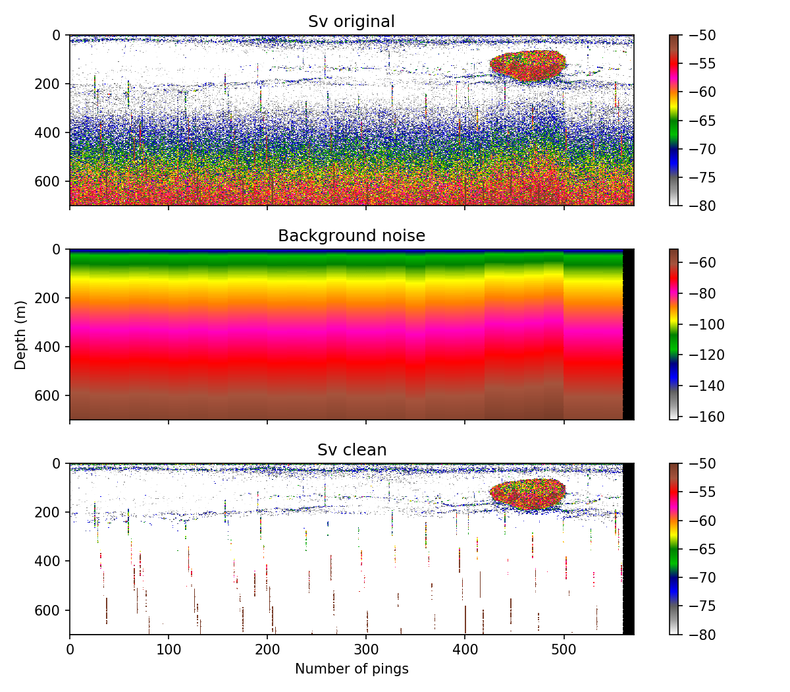
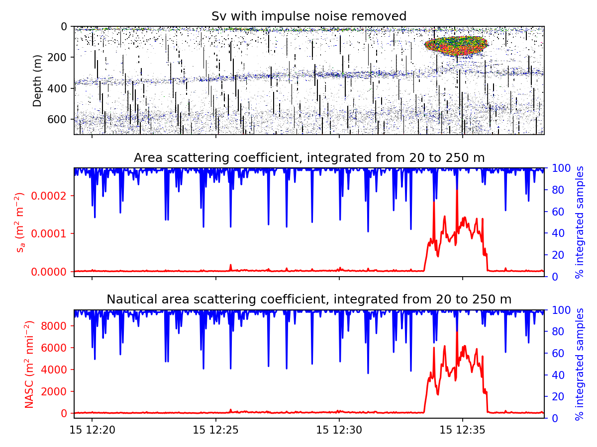
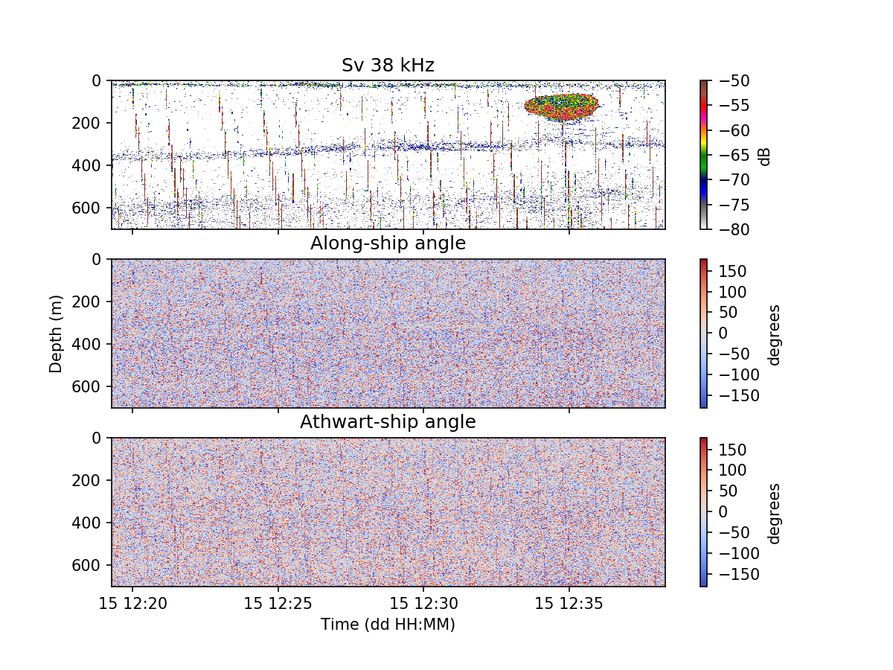
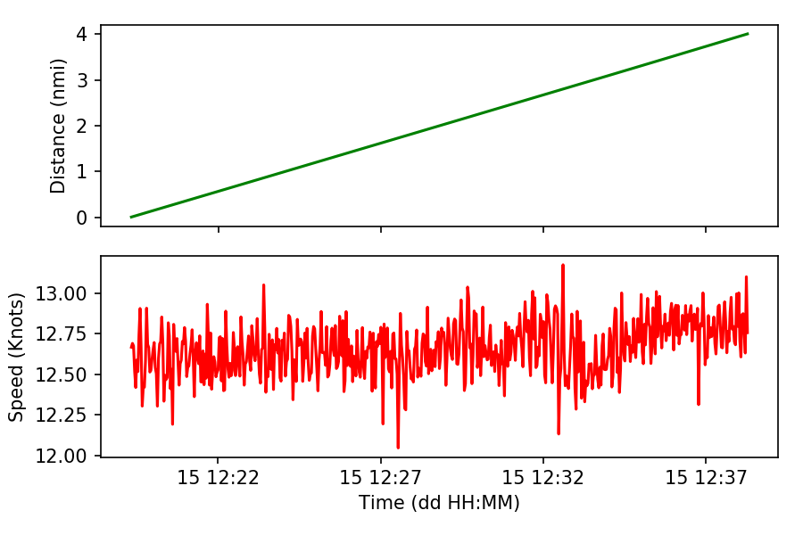
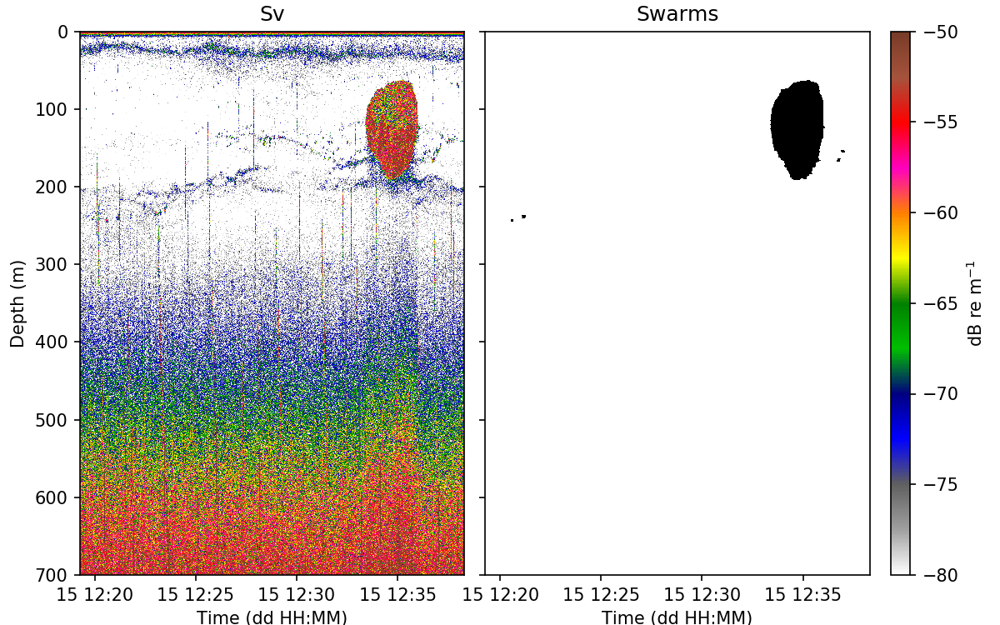
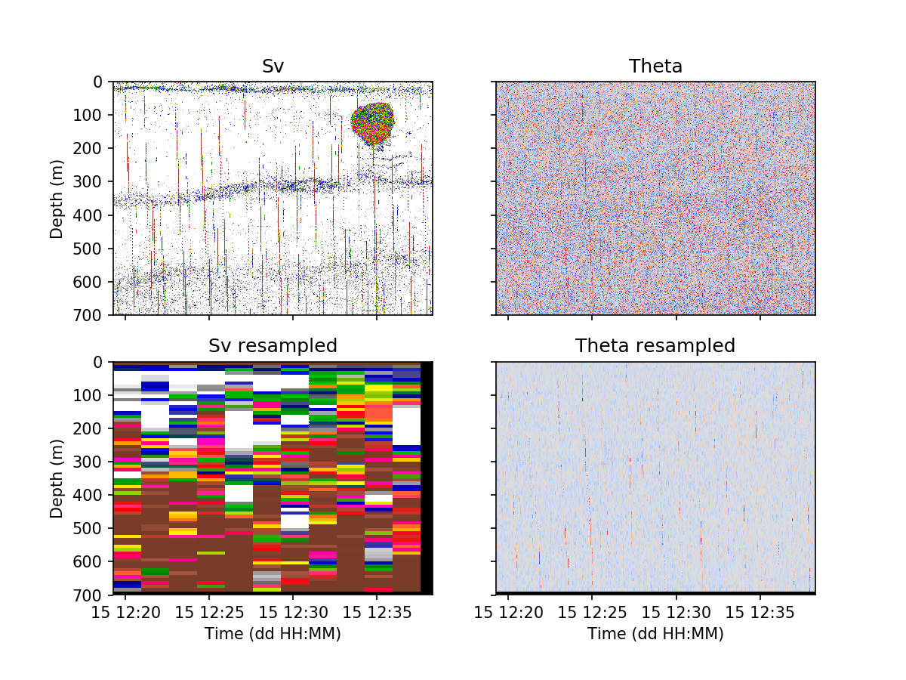

This folder contains processing examples using the echopy package,

# calibration.py
 

# cleaning_background.py

# compute_area_scattering.py

# display_Sv_and_angles.py

# getting_distance_and_speed.py

# masking_attenuated.py

# masking_impulse.py

# masking_seabed.py

# masking_swarms.py

# resampling.py

